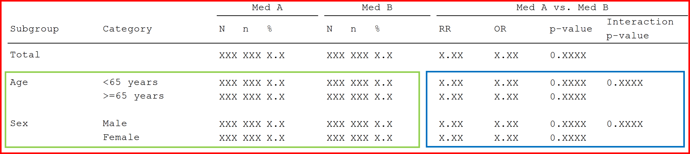
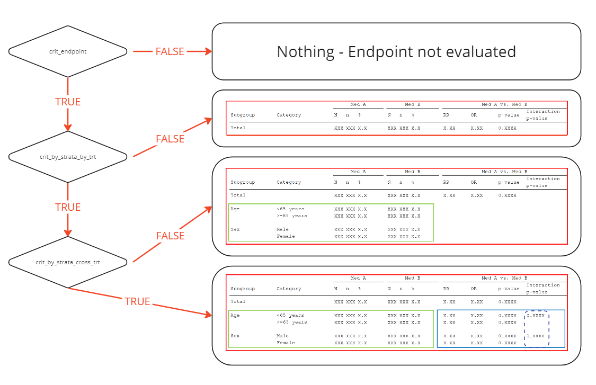

# Criteria Methods

## Introduction

This vignette provides a short introduction to the idea of analysis
criteria.

The analysis request from the authorities will detail an overall set of
endpoints, irrespective of the underlying study data. For example, they
might request an analysis of serious adverse events by system organ
class, by gender. Such an analyses may contain many cells with zeros, or
very low counts. To ensure only analyses that contain meaningfully
amounts of data are included, the request may additionally include
certain criteria for the inclusion of an analysis, such as a threshold
for the minimum number of records, events, or subjects.

The logic for these analysis inclusion criteria are handled by the
functions supplied to the `crit_endpoint`, `crit_by_strata_by_trt`, and
`crit_by_strata_across_trt` arguments when defining an endpoint in
`mk_endpoints_str()`.

## Criteria levels

Currently, {chef} supports analysis inclusion criteria for three parts
of the analysis output, with colors corresponding to the figure below:

1.  The entire endpoint
2.  The `stat_by_strata_by_trt`
3.  The `stat_by_strata_across_trt` and `stat_across_strata_across_trt`



The criteria functions are hierarchical; failure to meet criteria at
Level A (Entire Endpoint) implies automatic failure at Levels B and C.
Similarly, passing Level A but failing Level B results in failure at
Level C.

If an endpoint does not satisfy a certain criterion, the associated
statistical functions will not execute to reduce compute time. For
instance, if an endpoint does not meet the criteria at Level B, by
strata and across treatment arms analyses will not be performed.
However, the analyses for the Totals will still proceed.

It is important to note that these criteria are optional. Not every
endpoint definition needs to incorporate all three levels of criteria.
Some analyses may have no criteria, while others might require criteria
only at the endpoint or strata.

**NOTE** that the `crit_by_strata_across_trt` criterion gate-keep both
`stat_by_strata_across_trt` and `stat_across_strata_across_trt`
(stippled box). The `stat_across_strata_across_trt` is seen as lower on
the hierarchical criteria ladder than `stat_by_strata_across_trt` -
however it does not have a seperate criterion at this time and will
therefore be included by default.



## Function formals

Chef supplies a number of parameters the criterion functions. The
parameters vary according to the statistical method. Note that for
`crit_by_strata_by_trt`, and `crit_by_strata_across_trt` the formals of
the functions are identical.

### Input specifications

The criteria functions are served broad set of parameters. This reflects
the need for flexibility in the criteria functions.

The flexibility allows you to set criteria that affect specific stratum
based on that specific stratum or on information shared across multiple
strata.

This allows you to create criteria functions which only target one
stratum or act across the whole strata:

- Criteria1 requires that in the endpoint the strata GENDER must be
  balanced. (ie approx 50/50 distribution.) (requires only the
  `stratify_by` parameter)
- Criteria2 requires that for the endpoint all strata (GENDER, AGE) must
  be balanced. (requires the `stratify_by` parameter)
- *You may also also design criteria for endpoints, which only includes
  in the case where there is enough subjects in relevant strata.*

*See [Examples](#example-functions)*

*NB* Similar to the stat methods we require that criteria function
include ellipses (`...`) as a wildcard parameter. This is both a
convenience, since you then only need to explicitly state the used
parameters in your function definition. However, more importantly it
will ensure that a criteria function you define today will also work
tomorrow, where {chef} may supply more parameters to the criteria
functions.

- Endpoint criteria functions
- Strata criteria functions

| Parameter | Type | Example | Description |
|----|----|----|----|
| dat | data.table::data.table |  | Dataset containing the \[Analysis population\] (ep_spec_poplation_def.html) |
| event_index, | List(Integer) | `[1, 3, 5]` | Index (pointing to the `INDEX_` column) of rows with an [Event](https://hta-pharma.github.io/ramnog/articles/ep_spec_event.md) |
| subjectid_var | Character | `"USUBJID"` | The column containing the subject id. |
| treatment_var, | Character | `"treatment_name"` | The column name describing treatment type |
| treatment_refval, | Character | `"Placebo"` | The treatment refval for the `treatment_var` column for the endpoint. |
| period_var, | Character | `"period_block"` | The column name describing the periods |
| period_value, | Character | `"within_trial_period"` | The value in the `period_var` which is of interest to the endpoint. |
| endpoint_filter | Character (escaped) | `"\"someColumn\" == \"someValue\""` | Specific endpoint filter |
| endpoint_group_metadata | List |  | Named list containing by_group metadata |
| stratify_by | List(Character) | `['Sex', 'Gender']` | The [strata](https://hta-pharma.github.io/ramnog/articles/ep_spec_strata_def.md) which the endpoint is sliced by. |

| Parameter | Type | Example | Description |
|----|----|----|----|
| dat | data.table::data.table |  | Dataset containing the [Analysis population](https://hta-pharma.github.io/ramnog/articles/ep_spec_poplation_def.md) |
| event_index, | List(Integer) | `[1, 3, 5]` | Index (pointing to the `INDEX_` column) of rows with an [Event](https://hta-pharma.github.io/ramnog/articles/ep_spec_event.md) |
| subjectid_var | Character | `"USUBJID"` | The column containing the subject id. |
| treatment_var, | Character | `"treatment_name"` | The column name describing treatment type |
| treatment_refval, | Character | `"Placebo"` | The treatment refval for the `treatment_var` column for the endpoint. |
| period_var, | Character | `"period_block"` | The column name describing the periods |
| period_value, | Character | `"within_trial_period"` | The value in the `period_var` which is of interest to the endpoint. |
| endpoint_filter | Character (escaped) | `"\"someColumn\" == \"someValue\""` | Specific endpoint filter |
| endpoint_group_metadata | List |  | Named list containing by_group metadata |
| stratify_by | List(Character) | `['Sex', 'Gender']` | The [strata](https://hta-pharma.github.io/ramnog/articles/ep_spec_strata_def.md) which the endpoint is sliced by. |
| strata_var | Character | `"Sex"` | The specific stratification which the criteria relates to. |

### Output specifications

The output of the criteria function must be a simple `boolean` (`TRUE`
or `FALSE`)

### Example functions

Below are two examples showcasing how to write criteria functions. It is
not within scope of the {chef} package to provide a library of criteria
functions.

- Endpoint criteria functions
- Strata criteria functions

Generic criteria function: Allows control over endpoint inclusion based
on the count of subjects with events in the arms.

This function is a generic that can the be specified in the
mk_endpoint_str or curried beforehand ([Stat
methods-Currying](https://hta-pharma.github.io/ramnog/articles/methods_stat.html#custom-functions-currying-and-supplying-parameters-))

``` r

ep_criteria.treatment_arms_minimum_unique_event_count <- function(
    dat,
    event_index,
    treatment_var,
    subjectid_var,
    minimum_event_count,
    requirement_type = c("any", "all")
    ...
    )
  # rows with events
  dat_events <- dat[J(event_index),]

  # Bolean of whether the count of unique subjects 
  # within each treatment arm is above the minimum count.  
  dat_lvl_above_threshold <- dat_events[
    , 
    list("is_above_minimum" = data.table::uniqueN(subjectid_var)>=minimum_event_count), 
    by=treatment_var
  ]
  
  if requirement_type == "any":
    return( any(dat_lvl_above_threshold$V1) )
  return( all(dat_lvl_above_threshold$V1) )
  
```

Only include the across strata and treatment arm analysis if there are
at least X subjects with events in each treatment arm. For
requirement_type==“any” just a single cell (stratum + treatment arm)
needs to be included.

``` r

ep_strata_criteria.strata_treatment_arm_minimum_unique_count <- function(
    dat,
    event_index,
    treatment_var,
    subjectid_var,
    strata_var,
    minimum_event_count,
    requirement_type = c("any", "all")
    ...
    )
  # rows with events
  dat_events <- dat[J(event_index),]

  # Bolean of whether the count of unique subjects 
  # within each treatment arm is above the minimum count.  
  dat_lvl_above_threshold <- dat_events[
    , 
    list("is_above_minimum" = data.table::uniqueN(subjectid_var)>=minimum_event_count), 
    by=c(treatment_var, strata_var)
  ]
  
  if requirement_type == "any":
    return( any(dat_lvl_above_threshold$is_above_minimum) )
  return( all(dat_lvl_above_threshold$is_above_minimum) )
```

### Applying criteria functions

Criteria functions are supplied to the mk_endpoint_str function and is
used to gatekeep which statistical function are run.

An example of a endpoint could be:

We look at the population with an event E_XYZ.

- We are only interested in the endpoint if we see at least 5 subjects
  in any of the arms that have event E_XYZ.
- We are only interested in getting descriptive statistic for any strata
  (say GENDER, AGEGRP) if the all levels within have at least 1 subject.
- Finally, we only run the across treatment arm statistics if there are
  at least 5 subject in each stratum and each treatment arm.

The above requirements/gates are implemented by currying the functions
given in the [Examples](#examples) section.

``` r


# R/project_criteria.R
# Curry the general criteria functions from [Examples](#examples)

crit_accept_endpoint.5_subjects_any_treatment_arm <- purrr:partial(
  ep_criteria.treatment_arms_minimum_unique_event_count,
  minimum_event_count = 5,
  requirement_type = "any"
)

crit_strata.1_subject_all_treatment_strata <- purrr:partial(
  ep_sg_criteria.sg_treatment_arm_minimum_unique_count,
  minimum_event_count = 1,
  requirement_type = "all"
)

crit_strata.5_subject_all_treatment_strata <- purrr:partial(
  ep_sg_criteria.sg_treatment_arm_minimum_unique_count,
  minimum_event_count = 5,
  requirement_type = "all"
)

# R/project_endpoints.R

endpoint_XYZ  <- chef::mk_endpoint_str(
  ..., # Setting the rest of the inputs
  crit_endpoint = list(crit_accept_endpoint.5_subjects_any_treatment_arm),
  crit_by_strata_by_trt = list(crit_strata.1_subject_all_treatment_strata),
  crit_by_strata_across_trt = list(crit_strata.5_subject_all_treatment_strata)
)
```
