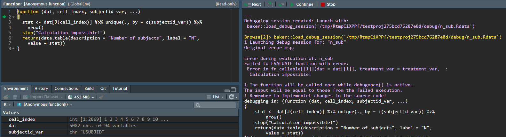

```{r, include = FALSE}
knitr::opts_chunk$set(
  collapse = TRUE,
  comment = "#>"
)
```

Debugging a {chef} pipeline is different than debugging normal R scripts or functions. This is because under the hood, {chef} makes heavy use of the {[targets](https://books.ropensci.org/targets/)} package.

We present here two main approaches to debugging:

  - Use the {chef} helper functions
  - Use the {[targets](https://books.ropensci.org/targets/)} helper functions
  
The {chef} debugging helper functions are best for normal debugging situations, while using the {targets} helper functions may be needed for more in-depth debugging sessions.


## Context - why debugging is different

In a {chef} pipeline, the execution environment is managed by {[targets](https://books.ropensci.org/targets/)}, and does **not** take place in your working environment. As a side-effect, it is not be as straightforward to reproduce errors or trace them back to their source. Specifically:

  - Each target in a {targets} pipeline is run in an new R session that closes upon completion or hitting an error. This means that the working environment is clean for every run, which is beneficial for reproducibility but can make it harder to debug because the state that led to an error might not be readily accessible.
  
  - {targets} uses a caching mechanism to avoid re-running successful tasks. While this feature enhances efficiency, it can make debugging tricky. Understanding whether a bug is due to current code or cached results might not be straightforward
  
  - Sometimes, the error messages from a {targets} pipeline can be cryptic or not very informative, making it harder to figure out what's going wrong.
  
  - Debugging often requires interactively running code to inspect objects and their states. However, {targets} is designed for non-interactive batch (and sometimes parallel) execution, which can make interactive debugging less straightforward. For example, you cannot just insert a `browser()` into the function that errored out like you would in interactive debugging.

## {chef} style debugging

The most common errors will be due to errors stemming from improper user inputs (e.g. the user-supplied functions that that generate the input ADaM datasets, or contain the statistical methods). To debug these, it is easiest if the programmer has access to the state of the program at the time it errored-out.

Errors stemming from user function are split into two types:

- Firstly, those relating to the function formals or more specifically whether the function inputs will match with those supplied by {chef}. 

- Secondly, errors which arise during the evaluation of the function and validation of its output. These errors can come from bug in the functions causing crashing at runtime, or functions which return an invalid output.

### Input errors

Input errors stems from mismatch between the expected arguments of a function and those arguments which {chef} supplies. Errors in this domain could stem from improperly defined statistical functions or for instance statistical functions applied to wrong statistical types in the endpoint specification.

For each function that the user can define {chef} supplies a predefined set of arguments ([data](ep_spec_adam_data.html#overview), [statistics](methods_stat.html#input-specifications-and-examples), [criteria](methods_criteria.html#input-specifications)). These arguments are always supplied, why function must either have an exhaustive function definition, or as *recommended* include dots (...) in the function definition to allow the functions to ignore those arguments, which are not required by the specific function.

##### Examples:

An **over-defined function** is a function which require arguments which are not supplied.

```
# Given a data_prepare function:
my_data <- function(study_metadata, specific_arg){
  #...
}

# Would give rise to the following error:

Function (my_data) of type (data_prepare) expects argument(s) which is not supplied:
	specific_arg
Supplied arguments:
	study_metadata
Expected arguments: (required, [optional])
	specific_arg, study_metadata []
```

In the above example, the expect-but-no-supplied argument `specific_arg` is clearly described as well as those arguments {chef} supplies (`study_metadata`) and the full function argument specification.

---

An **under-defined function** is a function which does not explicitly require all the supplied arguments and also doesn't have dots (...) included to catch surplus arguments.

```
# Given a data_prepare function:
my_data <- function(arg_w_default=2){
  #...
}

# Would give rise to the following error:

Function (my_data) of type (data_prepare) is supplied arguments it does not expect:
	study_metadata
Supplied arguments:
	study_metadata
Expected arguments: (required, [optional])
	 [my_def_arg]
Either state all supplied args explicitely or use dots (...) as a passthrough (recommended).

```

In the under-defined example the function does not expect the supplied `study_metadata` argument. This example also shows how optional arguments (with default values) are displayed.

### Evaluation and validation errors

{chef} has built-in helpers that provide the user the state of the pipeline when a user-supplied function errors-out. By using these helpers, the programmer can access the workspace (i.e., all objects and functions) at the point of the error. Then they can debug interactively like normal R debugging.

In broad terms {chef} will supply the user with the function and input parameters that lead to an erroneous evaluation. {chef} will supply debugging sessions if the function crashes or if the function output is not compliant. ([Statistical output](methods_stat.html#output-specification-shared-for-all-types), [Criterion output](methods_criteria.html#output-specifications))

For failures during the evaluation the error message will contain the keyword `EVALUATE` while non-conforming outputs will result in errors with the `VALIDATE` keyword. Sample error messages can be seen in the following.

```
# Error message wrt. validation

Error during evaluation of: log(1)
Failed to VALIDATE function output with error:
Expected (data.table::data.table) Found: numeric

# Error message wrt. evaluation

Error during evaluation of: P-interaction
Failed to EVALUATE function with error:
 Error : argument "cell_index" is missing, with no default
```

##### Debugging session:

When an evaluation fails or the output is non-compliant {chef} will collect the inputs to the function and the function and write it to file as a new environment object. 

The debugging environment will be written to a debugging subfolder of the current working directory as an .RDS file.
The problem can then be investigated using the built-in function `chef::load_debug_session()` or by loading it directly into your session using `readRDS()`.


##### Debugging example:

In this example we will review the debugging flow for a faulty stat method.

1. We define an endpoint with a single statistic.
```{r, eval=F}
mk_ep_def <- function() {
              ep  <- chef::mk_endpoint_str(
                ..., # The rest of the input parameters.
                stat_by_strata_by_trt = list("n_sub" = n_sub),
              )
            }
```

2. We then setup the pipeline as described in [End-to-End examples](example_end2end.html).

3. We execute the pipeline with `tar_make()`

We can then check the output messages from the target run:
The `▶` indicates a starting target evaluation and `●`, `✖` indicates a successful and failed evaluation respectably.

__Console output__
```
tar_make()
Loading required package: targets
▶ start target ep
● built target ep [0.038 seconds]
▶ start target ep_id
● built target ep_id [0.001 seconds]
(...) # We ignore some other upstream target evaluations.
▶ start target ep_stat_by_strata_by_trt
✖ error target ep_stat_by_strata_by_trt
▶ end pipeline [3.556 seconds]
Error: Error running targets::tar_make()
  Error messages: targets::tar_meta(fields = error, complete_only = TRUE)
  Debugging guide: https://books.ropensci.org/targets/debugging.html
  How to ask for help: https://books.ropensci.org/targets/help.html
  Last error: 
Error during evaluation of: n_sub
Failed to EVALUATE function with error:
 Error in fn_callable[[1]](dat = dat[[1]], treatment_var = treatment_var,  : 
  Calculation impossible!

---
Debugging session created: Launch with:
 chef::load_debug_session('/tmp/RtmpCiXPPf/testproj275bcd76287e8d/debug/n_sub.Rdata')
---
```
You can see that the pipeline failed during the evaluation of the target-step `ep_stat_by_strata_by_trt`. Furthermore, you can view the `Last error` to get a meaningful error message.
Here it shows that it failed to evaluate the function aliased `n_sub` and an error with the message `Calculation impossible`

We can inspect the problem further running the suggested command:
-  `chef::load_debug_session('/tmp/RtmpCiXPPf/testproj275bcd76287e8d/debug/n_sub.Rdata')`

```{r criteria1, echo=FALSE, out.width="100%"}

```

We can then play around with the function, given the supplied inputs.

In this toy example we simply have a function which throws an error - a simple error to fix. However, this tool provides you with the possiblity to explore and tinker with your functions in the context which they fail in the pipeline.
NB. as mentioned in the console message - remember to update you changes to the source code!

## Targets style debugging

There are several approaches to debugging a pipeline that is erroring out. Find much more details in the [targets manual](https://books.ropensci.org/targets/debugging.html):

 - In a clean R session, load the inputs to the target that is producing the error via `tar_load(names = c(<target_names))` then debug the function for the target interactively like you would debug an other R function
 
 - Run `tar_make(callr_function = NULL)` instead of the usual `tar_make`. This executes the pipeline in the current R session rather than a seperate R process, then you can debug interactively using standard R debugging approaches.
