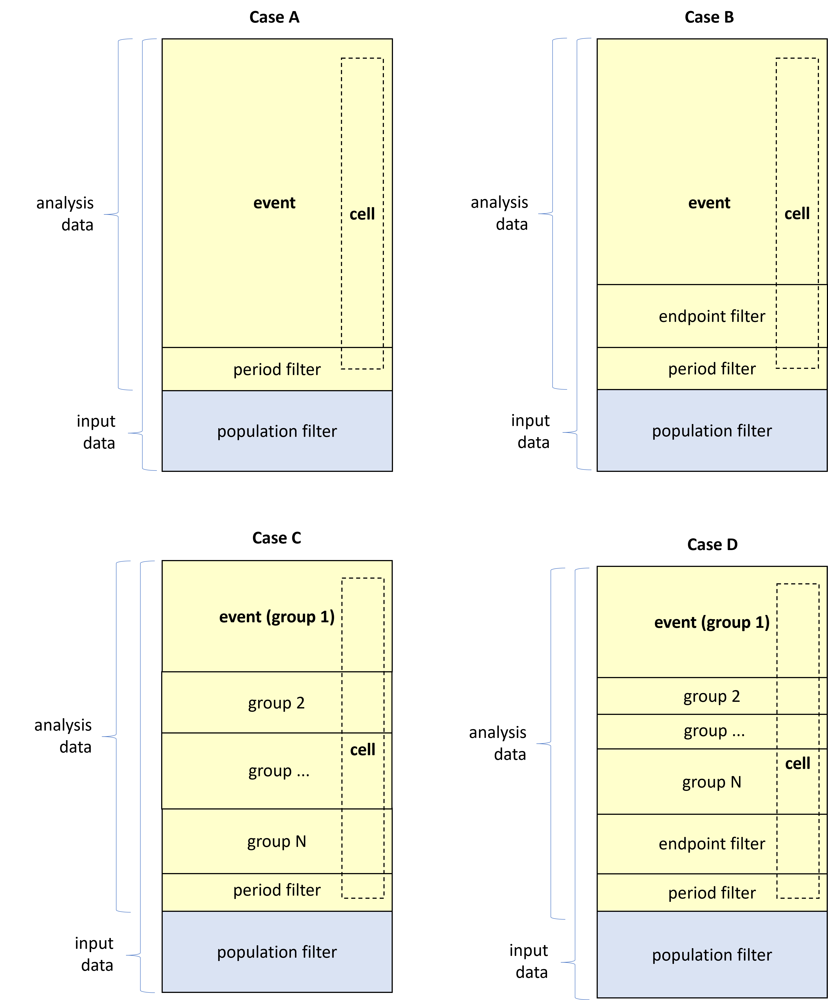

```{r, include = FALSE}
knitr::opts_chunk$set(
  collapse = TRUE,
  comment = "#>"
)
```

<!-- avoid border around images -->
<style>
    img {
        border: 0;
    }
</style>

# Overview

Events are the records in the analysis data that are defined as 'positives' in the context of the endpoint. 
For example, adverse events of a certain type may be events for one endpoint, while for a demographic endpoint all subjects in the analysis data (that comply to the period filter) are events. 

Since the events are bounded to the rows of the analysis data, the entity of an event is not fixed. It depends on the analysis data. It may e.g. be a set of visits, or measurements, or subjects.

For each endpoint the definition of an event is controlled via the following endpoint specification parameters:

* **period_var**: Name of the flag variable in the analysis data set that indicates if the record is contained the required time slot for being an event.
* **period_value**: The value of `period_var` that indicates if the record is in the required time slot.
* **endpoint_filter**: An optional parameter that contains a free text endpoint filter that adds to the period filter defined by `period_var` and `period_value`.
* **group_by**: An optional parameter that splits the analysis data in exclusive groups that each is injected to their own endpoint. This adds to narrowing down the endpoint events as it disregards any events outside the group specific to the endpoint.

Let us investigate how each of these parameters affect the set of events that are exposed to the endpoint.

Initially, the input data returned from `data_prepare` is filtered to create the analysis data using the population filter c.f. [Analysis population](ep_spec_population_def.html). 
Next, the endpoint **events** in the analysis data are identified according to the filters above.

Within the endpoint itself, each **cell** in the statistics also slices the analysis data by e.g. strata and treatment arm combinations. 
The strata work independently of the event definition, so within each strata there may be both event and non-events. See [Strata](ep_spec_strata_def.html) for further details.    

The illustrations below depict the four possible cases of combining the event specification parameters.

```{r fig_ep_event, echo=FALSE, out.width="80%", fig.align = "left"}

```

&nbsp;

* **Case A**: Only the period filter (`period_value` and `period_var`) is applied in which case all analysis data records that meet the period filter are events.
* **Case B**: The period filter and the endpoint filter are active.
* **Case C**: Same setup as in case A with the addition of endpoint grouping so that the events are further restricted within each group element. The case illustrates the setup for one of the group levels (group 1).
* **Case D**: Same setup as in case B with the addition of endpoint grouping so that the events are further restricted within each group element. The case illustrates the setup for one of the group levels (group 1).

# Examples

##### Ex 4.1

Here are three examples of the syntax for supplying the period filter, the endpoint filter and the endpoint grouping, respectively, in the endpoint specification.

```{r, eval = FALSE}
# Example of partial endpoint specification with period filter
ep_spec_ex4_1_1  <- chef::mk_endpoint_str(
  period_var = "ANL01FL"
  period_value = "Y",
  ...)

# Example of partial endpoint specification with endpoint filtering
ep_spec_ex4_1_2  <- chef::mk_endpoint_str(
  endpoint_filter = 'ASEV == "MILD"',
  ...)

# Example of partial endpoint specification with endpoint grouping
ep_spec_ex4_1_3  <- chef::mk_endpoint_str(
  group_by = list(list(AESEV = c("MILD", "MODERATE", "SERVERE"))),
  ...)
```

##### Ex 4.2

You may also state the group levels in a lazy manner in which case all group levels in the analysis data set is applied. This is useful if you group by a variable with many levels e.g., system organ class (SOC), or if you which to leave out certain group levels. Here is an example of how to supply a lazy grouping of SOC. 

```{r, eval = FALSE}
# Example of partial endpoint specification with lazy endpoint grouping
ep_spec_ex4_2  <- chef::mk_endpoint_str(
  group_by = list(list(AESOC = c())),
  ...)
```

##### Ex 4.3

In case you want to combine groups on multiple variables you can state each dimension of the grouping in the `group_by` parameter. This is useful for e.g., generating endpoint for each combination of adverse event severity and SOC as exemplified below with lazy grouping:

```{r, eval = FALSE}
# Example of partial endpoint specification with lazy endpoint grouping on multiple variables
ep_spec_ex4_3  <- chef::mk_endpoint_str(
  group_by = list(list(AESEV = c(), AESOC = c())),
  ...)
```

##### Ex 4.4

As a continuation of the previews example, if you are only interested in mild adverse events you can replace the grouping by `AESEV` by an endpoint filter that filters by `AESEV`.

```{r, eval = FALSE}
# Example of partial endpoint specification with endpoint filter and lazy grouping
ep_spec_ex4_4  <- chef::mk_endpoint_str(
  endpoint_filter = 'ASEV == "MILD"',
  group_by = list(list(AESOC = c())),
  ...)
```
