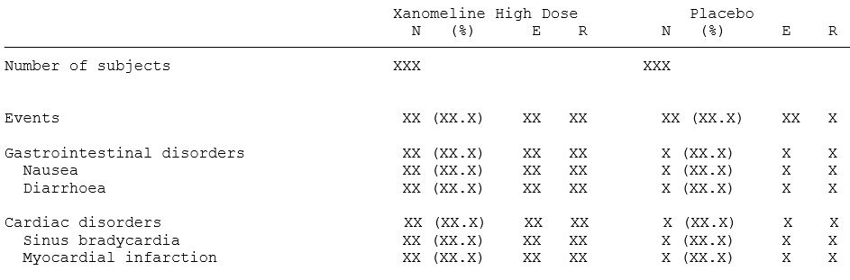
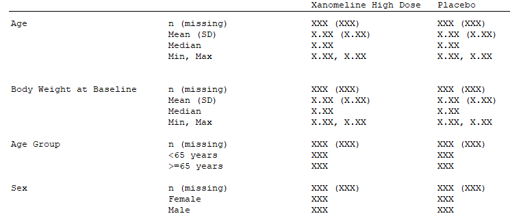
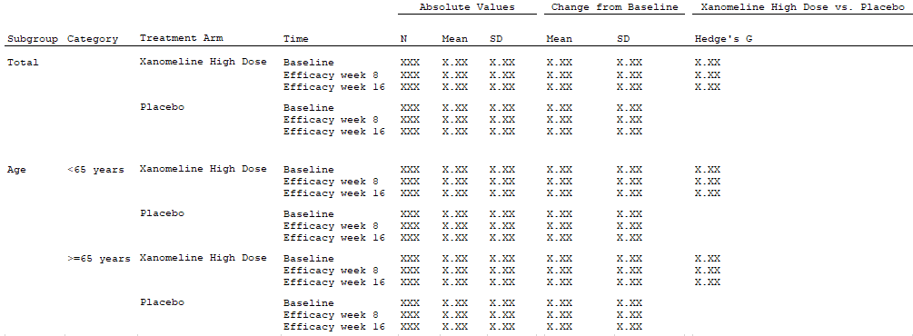

```{r, include = FALSE}
library(magrittr)
library(ramnog)
library(testthat)
library(data.table)
library(chef)
library(chefStats)
knitr::opts_chunk$set(
  collapse = TRUE,
  comment = "#>"
)

```

<!-- ```{css, echo=FALSE} -->
<!-- pre { -->
<!--   max-height: 1000px; -->
<!--   overflow-y: auto; -->
<!-- } -->

<!-- pre[class] { -->
<!--   max-height: 650px; -->
<!-- } -->
<!-- ``` -->


This vignette provides catalog of endpoint examples, derived endpoint specifications and associated ADaM functions and statistical functions.

The endpoints are grouped into three categories:
 
 - Binary outcomes
 - Demographics
 - Continuous outcomes

## Endpoint types {.tabset .tabset-fade .tabset-pills }


#### Binary type 1

```{r fig_ep_ex1, echo=FALSE, out.width="100%", fig.align = "left"}
knitr::include_graphics("./figures/ep_spec_mockup_binary.png")
```

For the endpoints above, we note that the endpoint specification must contain statistics both by strata and treatment arm (`N`, `n`, `%`), by strata across treatment arms (`RR`, `OR`, `P-value`) and across strata and treatment arms (`P-value interaction`) which must be calculated on two strata (`Age`, `Sex`). The statistical functions will come from the library of statistical functions in {chefStats}.

We assume the endpoint concerns adverse events and must be applied to the full safety population set (`SAFFL="Y"`).

We also need the functions to produce the clinical data to pass to the `data_prepare`. Since this examlple analyses adverse events, we will need some version of the ADAE dataset. As these exact nature of the clinical dataset will differ from project-to-project, there is no library of data prep functions we can source from. Instead we define our own example functions here:

```{r eval=FALSE}
# Merge ADSL and ADAE from {pharmaverseadam}
mk_adae <- function(study_metadata) {

  # Read ADSL
  adsl <- data.table::as.data.table(pharmaverseadam::adsl)

  # Filter treatment arms
  adsl <- adsl[adsl$TRT01A %in% c("Placebo", "Xanomeline High Dose")]

  # New derived ADSL age group variable
  adsl[, AGEGR2 := data.table::fcase(AGE < 65, "AGE < 65",
    AGE >= 65, "AGE >= 65",
    default = NA
  )]

  # Read ADAE
  adae <- data.table::as.data.table(pharmaverseadam::adae)

  # Merge ADSL and ADAE
  adam_out <-
    merge(adsl, adae[, c(setdiff(names(adae), names(adsl)), "USUBJID"),
      with =
        F
    ], by = "USUBJID", all = TRUE)

  return(adam_out)
}
```

Let us consider different variations of this endpoint specification in the cases below.
In the examples we demonstrate how to apply the statistics either on the full population, by grouping on system organ class (SOCs) and severity, and filtered on severity.

Note that the set of SOCs is trimmed according to an endpoint criterion function (`ep_crit_min_subev_by_trt`), so that only SOCs with at least 5 subjects with events in at least one treatment arm are included. The criteria function will come from the library of criteria functions found in {chefCriteria}.

##### Case 1: Adverse events (base form)

```{r eval=FALSE}
ep_spec <- chef::mk_endpoint_str(
  data_prepare = mk_adae,
  treatment_var = "TRT01A",
  treatment_refval = "Xanomeline High Dose",
  pop_var = "SAFFL",
  pop_value = "Y",
  stratify_by = list(c("AGEGR2", "SEX")),
  stat_by_strata_by_trt = list(
    chefStats::n_subj,
    chefStats::n_subj_event,
    cheStats::p_subj_event
  ),
  stat_by_strata_across_trt = list(
    chefStats::RR,
    chefStats::OR,
    chefStats::p_val
  ),
  stat_across_strata_across_trt = list(chefStats::pval_interaction),
  endpoint_label = "Adverse events - <treatment_var>"
)
```


##### Case 2: Adverse events grouped by system organ class

```{r eval=FALSE}
ep_spec <- chef::mk_endpoint_str(
  data_prepare = mk_adae,
  treatment_var = "TRT01A",
  treatment_refval = "Xanomeline High Dose",
  pop_var = "SAFFL",
  pop_value = "Y",
  group_by = list(list(AESOC = c())),
  stratify_by = list(c("AGEGR2", "SEX")),
  stat_by_strata_by_trt = list(
    chefStats::n_subj,
    chefStats::n_subj_event,
    cheStats::p_subj_event
  ),
  stat_by_strata_across_trt = list(
    chefStats::RR,
    chefStats::OR,
    chefStats::p_val
  ),
  stat_across_strata_across_trt = list(chefStats::pval_interaction),
  crit_endpoint = list(
    c(
      ep_crit_min_subev_by_trt,
      min_n_subev = 5,
      requirement_type = "any"
    )
  ),
  endpoint_label = "Adverse events - <AESOC> - <treatment_var>"
)
```

##### Case 3: Mild adverse events grouped by system organ class

```{r eval=FALSE}
ep_spec <- chef::mk_endpoint_str(
  data_prepare = mk_adae,
  treatment_var = "TRT01A",
  treatment_refval = "Xanomeline High Dose",
  pop_var = "SAFFL",
  pop_value = "Y",
  endpoint_filter = 'ASEV == "MILD"',
  group_by = list(list(AESOC = c())),
  stratify_by = list(c("AGEGR2", "SEX")),
  stat_by_strata_by_trt = list(
    chefStats::n_subj,
    chefStats::n_subj_event,
    cheStats::p_subj_event
  ),
  stat_by_strata_across_trt = list(
    chefStats::RR,
    chefStats::OR,
    chefStats::p_val
  ),
  stat_across_strata_across_trt = list(chefStats::pval_interaction),
  crit_endpoint = list(
    c(
      ep_crit_min_subev_by_trt,
      min_n_subev = 5,
      requirement_type = "any"
    )
  ),
  endpoint_label = "Mild adverse events - <treatment_var>"
)
```

##### Case 4: Adverse events grouped by severity and system organ class

```{r eval=FALSE}
ep_spec <- chef::mk_endpoint_str(
  data_prepare = mk_adae,
  treatment_var = "TRT01A",
  treatment_refval = "Xanomeline High Dose",
  pop_var = "SAFFL",
  pop_value = "Y",
  group_by = list(list(ASEV = c(), AESOC = c())),
  stratify_by = list(c("AGEGR2", "SEX")),
  stat_by_strata_by_trt = list(
    chefStats::n_subj,
    chefStats::n_subj_event,
    cheStats::p_subj_event
  ),
  stat_by_strata_across_trt = list(
    chefStats::RR,
    chefStats::OR,
    chefStats::p_val
  ),
  stat_across_strata_across_trt = list(chefStats::pval_interaction),
  crit_endpoint = list(
    c(
      ep_crit_min_subev_by_trt,
      min_n_subev = 5,
      requirement_type = "any"
    )
  ),
  endpoint_label = "<ASEV> adverse events - <AESOC> - <treatment_var>"
)
```

#### Binary type 2

```{r, echo=FALSE, out.width="100%", fig.align = "left"}

```

To get results that match the table above, we can group the endpoints by `AESOC`, and then within each `AESOC` grouping, stratify by `AEDECOD`. By framing it as such, we can see that we need a statistic (`n` number of subjects with an event and `E` number of events) for every combination endpoint group (`AESOC`) and stratification level (`AEDECOD`). The statistical functions will come from chefStats.

We assume the endpoint concerns adverse events and must be applied to the full safety population set (`SAFFL="Y"`).

We also need the functions to produce the clinical data to pass to the data_prepare. Since this examlple analyses adverse events, we will need some version of the ADAE dataset. As these exact nature of the clinical dataset will differ from project-to-project, there is no library of data prep functions we can source from. Instead we define our own example functions here:

```{r}
# Merge ADSL and ADAE from {pharmaverseadam}
mk_adae <- function(study_metadata) {

  # Read ADSL
  adsl <- data.table::as.data.table(pharmaverseadam::adsl)

  # Filter treatment arms
  adsl <- adsl[adsl$TRT01A %in% c("Placebo", "Xanomeline High Dose")]

  # New derived ADSL age group variable
  adsl[, AGEGR2 := data.table::fcase(AGE < 65, "AGE < 65",
    AGE >= 65, "AGE >= 65",
    default = NA
  )]

  # Read ADAE
  adae <- data.table::as.data.table(pharmaverseadam::adae)

  # Merge ADSL and ADAE
  adam_out <-
    merge(adsl, adae[, c(setdiff(names(adae), names(adsl)), "USUBJID"),
      with =
        F
    ], by = "USUBJID", all = TRUE)

  return(adam_out)
}
```

```{r}

ep_spec <- chef::mk_endpoint_str(
    data_prepare = mk_adae,
    pop_var = "SAFFL",
    pop_value = "Y",
    treatment_var = "TRT01A",
    treatment_refval = "Xanomeline High Dose",
    group_by = list(list(AESOC = c())),
    stratify_by = list(c("AEDECOD")),
    stat_by_strata_by_trt = list(chefStats::n_subj_event,
                                 chefStats::n_event)
  )

```


#### Demographics

```{r fig_ep_ex2, echo=FALSE, out.width="100%", fig.align = "left"}

```

This table contains both continuous variables (`Age`, `Body Weight at Baseline`) and categorical variables (`Age Group`, `Sex`) for which different statistics are applied. So the endpoint will be split up in two endpoint specifications, one for the continuous variables (case 5), and one for the categorical variables (case 6).

For the categorical variables (`Age Group` and `Sex`), we see that we need a statistic for each stratification level of the category (e.g. `AGEGR1 < 65` and `AGEGR1 >= 65`). So it is clear that to get the results we need, we need one statistic per stratification level and treatment level. Thus we will supply our statistical function to the `stat_by_strata_by_trt` argument of our endpoint specification.

For the continuous variables it is less obvious. However, if we consider TOTAL to be a stratification just like age or sex, albeit with only a single level, then we can see that here we also need one statistic per strata level and treatment level, so will use the `stat_by_strata_by_trt`

In both cases a single statistical function is applied, (`chefStats::demographics_continuous()` and `chefStats::demographics_categorical()` respectively) which compactly supplies all required statistics in one function call. Alternatively, we can define separate functions for each statistics and apply the individually in the endpoint specification.

We also need the functions to produce the clinical data to pass to the `data_prepare`. Since this example analyzes body weight, we will need some version of the ADVS dataset. As these exact nature of the clinical dataset will differ from project-to-project, there is no library of data prep functions we can source from. Instead we define our own example that matches the needs of our analysis:

```{r eval=FALSE}
# Merge ADSL and ADVS from {pharmaverseadam}
mk_advs <- function(study_metadata) {

  # Read ADSL
  adsl <- data.table::as.data.table(pharmaverseadam::adsl)

  # Filter treatment arms
  adsl <- adsl[adsl$TRT01A %in% c("Placebo", "Xanomeline High Dose")]

  # New derived ADSL age group variable
  adsl[, AGEGR2 := data.table::fcase(AGE < 65, "AGE < 65",
    AGE >= 65, "AGE >= 65",
    default = NA
  )]
  # Read ADVS
  advs <- data.table::as.data.table(pharmaverseadam::advs)

  # Identify baseline body weight
  advs_bw <- advs[advs$PARAMCD == "WEIGHT" & advs$VISIT == "BASELINE"]

  # Create new variable BW_BASELINE
  advs_bw[["BW_BASELINE"]] <- advs_bw[["AVAL"]]

  # Merge ADSL, ADAE and baseline body weight from ADVS
  adam_out <-
    merge(adsl, advs_bw[, c("BW_BASELINE", "USUBJID")], by = "USUBJID", all.x = TRUE)

  return(adam_out)
}
```

We show how to define demographic endpoints for both continuous variables and categorical variables

##### Case 1: Baseline characteristics of analysis population (continuous variables)

```{r eval=FALSE}
chef::mk_endpoint_str(
  data_prepare = mk_advs,
  treatment_var = "TRT01A",
  treatment_refval = "Xanomeline High Dose",
  pop_var = "SAFFL",
  pop_value = "Y",
  stat_by_strata_by_trt = list(
    c(demographics_continuous,
      var = "AGE"
    ),
    c(demographics_continuous,
      var = "BW_BASELINE"
    )
  ),
  endpoint_label = "Demographics endpoint (categorical measures)"
)
```

##### Case 2: Baseline characteristics of analysis population (categorical variables)
```{r eval=FALSE}
chef::mk_endpoint_str(
  data_prepare = mk_advs,
  treatment_var = "TRT01A",
  treatment_refval = "Xanomeline High Dose",
  pop_var = "SAFFL",
  pop_value = "Y",
  stratify_by = list(c("AGEGR2", "SEX")),
  stat_by_strata_by_trt = list(c(demographics_counts)),
  endpoint_label = "Demographics endpoint (categorical measures)"
)
```

We then collect the two endpoint specifications to cover the complete endpoint:

```{r eval=FALSE}
ep_spec <- rbind(ep_spec_pt1, ep_spec_pt2)
```

#### Continuous outcomes

```{r fig_ep_ex3, echo=FALSE, out.width="100%", fig.align = "left"}

```

The table above contains statistics on baseline characteristics, as well as change-from-baseline. We observe that mean and SD are calculated on each combination of treatment arm, strata (total and age), time (baseline, week 8 and 16).
By defining time (`AVISIT`) as the endpoint grouping we can obtain all the statistics in one endpoint specification. This implies that:

* The mean and SD are calculated by treatment and strata levels (`stat_by_strata_by_trt`) on both the analysis data columns containing the baseline (`VALUE_BASELINE`) and change from baseline column (`VALUE_CHANGE`). 
* Number of subjects (`N`) is also calculated by treatment and strata level (`stat_by_strata_by_trt`).
* For each endpoint grouping (`AVISIT`) Hedge's G is calculated by each strata level and across treatment arms (`stat_by_strata_across_trt`).

We also need the functions to produce the clinical data to pass to the `data_prepare`. Since this example analyses laboratory data, we will need some version of the ADLB dataset. As these exact nature of the clinical dataset will differ from project-to-project, there is no library of data prep functions we can source from. Instead we define our own example that matches the needs of our analysis:

```{r eval=FALSE}
# Merge ADSL and ADLB from {pharmaverseadam}
mk_adlb <- function(study_metadata) {
  # Read ADSL
  adsl <- data.table::as.data.table(pharmaverseadam::adsl)

  # Filter treatment arms
  adsl <-
    adsl[adsl$TRT01A %in% c("Placebo", "Xanomeline High Dose")]

  # New derived ADSL age group variable
  adsl[, AGEGR2 := data.table::fcase(AGE < 65, "AGE < 65",
    AGE >= 65, "AGE >= 65",
    default = NA
  )]

  # Read ADLB
  adlb <- data.table::as.data.table(pharmaverseadam::adlb) %>%
    .[.[["PARAMCD"]] == "SODIUM" &
      .[["AVISIT"]] %in% c("Baseline", "Week 8", "Week 16"), ]

  adlb2 <-
    merge(adlb,
      adlb[adlb$AVISIT == "Baseline", c("USUBJID", "AVAL")],
      by = "USUBJID", all.x = TRUE
    )

  adlb2[["VALUE_BASELINE"]] <- adlb2[["AVAL.y"]]
  adlb2[["VALUE_CHANGE"]] <- adlb2[["AVAL.x"]] - adlb2[["AVAL.y"]]

  # Merge ADSL and ADLB
  adam_out <-
    merge(adsl, adlb2[, c(
      "USUBJID",
      "PARAMCD",
      "AVISIT",
      "VALUE_BASELINE",
      "VALUE_CHANGE",
      "ANL01FL"
    )], by = "USUBJID", all.x = TRUE)

  return(adam_out)
}
```

The endpoint specification showing "summary statistics on baseline and change from baseline" is shown below

```{r eval=FALSE}
chef::mk_endpoint_str(
  data_prepare = mk_adlb,
  treatment_var = "TRT01A",
  treatment_refval = "Xanomeline High Dose",
  pop_value = "Y",
  group_by = list(list(AVISIT = c())),
  stratify_by = list(c("AGEGR2")),
  stat_by_strata_by_trt = list(
    "n_sub" = chefStats::n_subj,
    "mean: VALUE_BASELINE" = c(chefStats::mean_value, var = "VALUE_BASELINE"),
    "mean: VALUE_CHANGE" = c(chefStats::mean_value, var = "VALUE_CHANGE"),
    "sd: VALUE_BASELINE" = c(chefStats::sd_value, var = "VALUE_BASELINE"),
    "sd: VALUE_CHANGE" = c(chefStats::sd_value, var = "VALUE_CHANGE")
  ),
  stat_by_strata_across_trt = list(hedgesg),
  endpoint_label = "Baseline and change from baseline on SODIUM - <AVISIT>"
)
```
