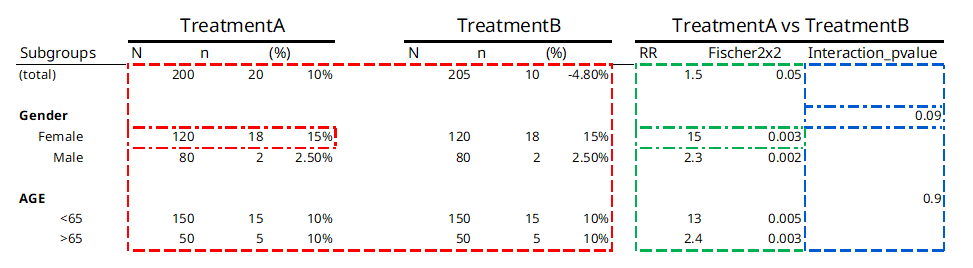

```{r, include = FALSE}
library(kableExtra)
knitr::opts_chunk$set(
  collapse = TRUE,
  comment = "#>"
)
```

## Statistical method types

The {chef} framework categorizes statistical functions into three main categories depending on how they operate over stratification levels and treatment levels. Operations can either be done once per stratification level or treatment level, or they can operate across levels. 

Figure 1 below shows a typical table from a safety analysis and color codes each result based on the function type that creates it:

```{r statDesc, echo=FALSE, out.width="100%", fig.cap="Figure 1"}

```

<br>
Table 1 below provides a description of each of the three function types, color coded to the outputs they produce in table 1 above:

```{r, echo=FALSE}
dt <-
  data.table::data.table(
    Name = c(
      cell_spec("stat_by_strata_and_trt", "html", color = "red"),
      cell_spec("stat_by_strata_across_trt", "html", color = "green"),
      cell_spec("stat_across_strata_across_trt", "html", color = "blue")
    ),
    Description = c(
      "One output per combination of strata level and treatment level _for each strata type_ (e.g. SEX, AGEGR, etc): ",
      "One output per strata level, across treatment levels _for each strata type_ (e.g. SEX, AGEGR, etc): ",
      "One output per strata type (e.g. SEX, AGEGR, etc), across treatment levels"
    ),
    
    `Example function` = c(  "`n_subj()` - Counts number of subjects in each stratification level and treatment level",
      "`RR()` - Calculates the relative risk for the outcome/event within a stratification level",
      "`p_val_interaction()` - Test of interaction effect for stratification level"
    ),
    `Example application` = c(
      "How many female subjects are in TreatmentA (_answer = 120_)",
      "What is the RR of having the outcome for females in Treatment A as compared to females in Treatment B (_answer = 15_)",
      "Is the risk of having the outcome different across the strata of SEX"
    )
  )
dt |>
  kable(format = "html",escape = FALSE,
        table.attr = "class='table table-bordered'",
        caption = "Table 1") |>
  kable_styling(bootstrap_options = c("hover", "condensed", "responsive")) |>
  row_spec(0, background = "lightblue") |>
  column_spec(1, bold = TRUE) |> 
  column_spec(3, width_max = "10em")

```


 
The function type also determines when the function is applied. In our example from figure 1, a <code style="color: red;">stat_by_strata_by_trt</code> function will be called once for each combination of stratification level and treatment level, as well as once for TOTALS for each treatment level: 

  1. SEX == "MALE" & TRT == "TreatmentA"
  2. SEX == "FEMALE" & TRT == "TreatmentA"
  3. SEX == "MALE" & TRT == "TreatmentB"
  3. SEX == "FEMALE" & TRT == "TreatmentB"
  3. AGE == "<65" & TRT == "TreatmentA" 
  3. AGE == ">=65" & TRT == "TreatmentA"
  3. AGE == "<65" & TRT == "TreatmentB"
  3. AGE == ">=65" & TRT == "TreatmentB"
  3. TOTAL_ == "total" & TRT == "TreatmentA"
  3. TOTAL_ == "total" & TRT == "TreatmentB"

Whereas a `stat_across_strata_across_trt` will only be called once per stratification "group", i.e.:
  
  1. strata_var == "SEX"
  1. strata_var == "AGE"

## Project-specific statistical functions

If you need a statistical function that does not exist in {chefStats}, we writing it and adding it the chefStats package, that way it can be used by others - please see the documentation in the chefStats package for more details.

But sometimes this might not make sense. In that case you can always reference your own custom function in the endpoint specification stored in the `R/` directory of your project folder.

For example you want a new function `my_custom_stats_function` of type <code style="color: red;">stat_by_strata_by_trt</code> . You first define the function:
```{r}
my_custom_function <- function(
    # function arguments here
  ){
  # Function does something here
}
```
Then once it's save to `R/`, you can reference it in the endpoint specification just like `chefStats` functions:

```{r, eval=FALSE}
chef::mk_endpoint_str(
  ..., # other arguments to mk_endpoint_str
  stat_by_strata_by_trt = my_custom_function)
```

__Important:__ if the custom function relies on any external packages, you need to add those packages to the `packages.R` file in `R/`.
